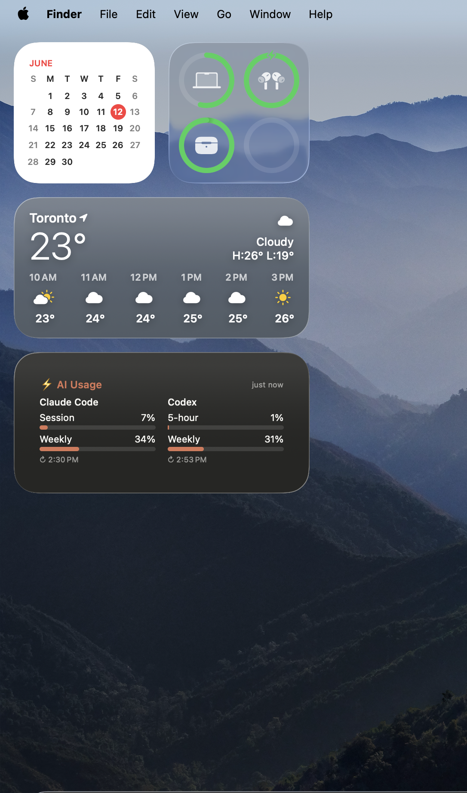
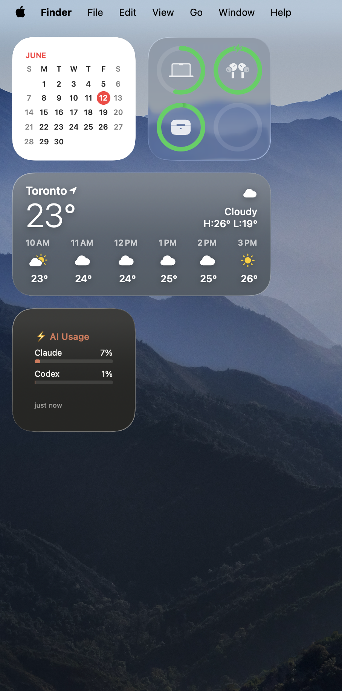

# AI Usage HUD

A macOS app that shows your **Claude Code** and **Codex** usage limits at a glance —
session/weekly bars, reset times, and today's token usage. Two surfaces from one
data layer: a **live desktop panel** (real-time) and a **native WidgetKit widget**
for the gallery / Notification Center.

<p align="center">
  
  &nbsp;&nbsp;
  
</p>

> The widget reads the same numbers as Claude Code's `/usage` and Codex's `/status`,
> in the Claude color convention (neutral → amber at 70% → red at 90%).

## Why

If you live in Claude Code and Codex, you want to know how much of your session and
weekly limits you've burned without running `/usage` and `/status` all day. This puts
it on your desktop and keeps it current automatically.

## The two surfaces

- **Live desktop panel** (Tauri) — pinned to the wallpaper layer like a widget but
  updates in real time (~30–60s), with ticking reset countdowns and active-session dots.
  Tray controls: Arrange (drag), Float on top, Refresh now, Launch at login, Quit.
- **Native widget** (WidgetKit, small + medium) — appears in the desktop widget gallery
  and Notification Center. Refreshes on macOS's schedule; a tiny background agent keeps
  its data fresh and pushes a redraw so it stays current with no app window open.

## How it works

```
Tauri app  ─┐                         ┌─ live desktop panel (real-time)
            ├─ providers (TS) ─ store ─┤
LaunchAgent ┘  (Claude + Codex)        └─ usage-snapshot.json ─→ WidgetKit widget
                                          (App Group container)
```

- **Providers** (TypeScript) read your existing CLI credentials and call the official
  endpoints, behind one `UsageProvider` interface. Adding a tool = one folder under
  `src/providers/` + one line in `registry.ts`.
  - Claude Code: OAuth token from your **Keychain** → `api.anthropic.com/api/oauth/usage`.
    Today's tokens parsed from `~/.claude/projects` logs.
  - Codex: token from `~/.codex/auth.json` → `chatgpt.com/backend-api/wham/usage`,
    with a local session-log fallback. Today's tokens from session logs.
- **Snapshot contract** — the app projects its store to a small versioned
  `usage-snapshot.json` in a shared **App Group** container; the Swift widget decodes it.
- **Headless auto-refresh** — a `launchd` agent runs a self-contained bundle every ~10
  minutes (and after wake) to refresh the snapshot and tell WidgetKit to redraw, so the
  widget stays current with zero app windows.

## Security posture

This tool reads your own credentials locally; it is built to be conservative:

- **Read-only credentials, never refreshed or stored.** Tokens are read at runtime and
  held in memory only — never written to disk, cache, or logs. The app never rotates
  your tokens (that would break the CLIs' own sessions).
- **Two-host network egress**, enforced in both the Rust HTTP command and the CSP:
  only `api.anthropic.com` and `chatgpt.com`. No telemetry, no third-party servers.
- **Provider HTTP goes through a host-allowlisted Rust command** (`reqwest`), not the
  webview — the webview HTTP path was returning 401/403 for valid tokens.
- **Filesystem reads** are scoped to `~/.claude` and `~/.codex`; writes only to app data.
- Both usage endpoints are undocumented — expect occasional breakage when they change.

## Build & run

Requirements: macOS 14+, Node, Rust (for Tauri), and **Xcode** (for the widget).

**The desktop panel (Tauri):**
```bash
npm install
npm run tauri dev      # run the panel
npm run tauri build    # produce the .app
npm test               # unit tests
npm run probe          # print all provider data in the terminal (no UI)
```
First run pops one macOS Keychain prompt for "Claude Code-credentials" — click **Always Allow**.

**The widget (Xcode):** open `macos-widget/AIUsageWidgetHost/`, set your team for both
targets, enable the **App Groups** capability (`group.com.<you>.aiusagehud`) on both, and
Run once. See `macos-widget/README.md` for the full steps.

**Headless auto-refresh (keeps the widget current with no window):**
```bash
scripts/install-widget-refresh.sh     # build + install the launchd agent
scripts/uninstall-widget-refresh.sh   # remove it
```

## Caveats

- **Free Apple ID signing** for the widget expires ~7 days; re-run the widget in Xcode
  to re-sign. A paid account removes this.
- **WidgetKit is OS-paced.** The data file is kept fresh, and the agent pushes a redraw,
  but macOS still controls exact refresh timing. The live panel is the real-time view.
- The bundle ids / App Group / signing team are set to the author's; **fork users should
  change `com.moomoo.*` and `group.com.moomoo.aiusagehud`** to their own.

## Tech stack

Tauri 2 · React + TypeScript · Vitest · Rust (objc2 desktop pinning, reqwest, keychain) ·
Swift / SwiftUI / WidgetKit.

## License

MIT — see [LICENSE](LICENSE).
